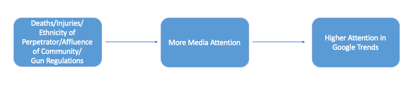

```{r, include = FALSE}
library(openxlsx)
library(xml2)
library(rvest)
library(jsonlite)
library(robotstxt)
library(RSocrata)
library(dplyr)
library(rlist)
library(pipeR)
library(gtrendsR)
library(lubridate)
library(writexl)
library(readxl)
library(tidyverse)
library(magrittr)
library(broom)
library(knitr)
library(ggplot2)
library(ggpubr)
library(systemfonts)
library(ggiraph)
library(devtools)
library(ggiraphExtra)
library(jtools)
library(broom.mixed)
library(stargazer)
library(ggstance)
library(sjmisc)
library(papeR)
library(kableExtra)
```

\newpage
# Introduction

On February 14th 2018 the Parkland High School shooting took place and with it one of the largest gun control movements emerged. 
At this incident a former student of the Marjory Stoneman Douglas High School killed 17 people and injured another 17 with a rifle [@Laughland2018]. The event was heavily covered by multiple news outlets and became the subject of a heated discussion about stricter gun laws in the US. One month later on March 24th there were nation wide protests called "March for Our Lives", led by the students in cooperation with the non-profit organization Never Again MSD, which demanded stricter gun laws [@Marchforourlives18]. It is not the first time, that a mass shooting started a discussion about gun regulations. Other shootings like the Sandy Hook Elementary School shooting in 2012 or the Orlando Nightclub shooting in 2016 have also drawn attention to the issue. A study showed, that media coverage regarding gun regulation increases after a mass shooting occurred. The following media coverage and the general attention on this topic can have a positive influence on policy making [@Luca2020]. For example, after the Parkland shooting Florida raised the minimum age for buying a rifle from 18 to 21 years [@Sanchez2018].


In general, the US has a long history of school and mass shootings, in 2019 alone there were 417 mass shootings [@Gva2020], which fall under the following definition: "incidents in which four or more persons are [injured] within a 24 hour period" with a rifle [@Duwe2000, p. 323]. Many of which got little to no media attention. One possible reason why smaller shootings gather less media coverage and therefore are brought less to our attention is because there are less exciting and therefore would not sell as good as other stories. And even if these small shootings are covered by news outlets, after a certain amount of time a new event occurs that overshadows the previous event [@Schildkraut2014]. This does not only apply to news outlets, also people in general are drawn to prominent issues and exciting events [@Silva2019]. If there is no new information on the topic published or more specifically people have seen enough of a topic they become fatigued towards the event. And ultimately they will loose interest in this topic. In figure 1 we can observe such a loss in interest. 

This graph displays the number of search hits for each keyword in relation to the general frequency in which they are searched for prior to the event period. We included the Sandy Hook shooting, which had 28 deaths and the Clackamas shooting which had 4 deaths [@wiki]. The x-axis describes the time period we observe for each shooting in this study, from one day prior to the event (Day 1), the event day (Day 2) and two weeks following the event date (Days 3-16). The y-axis shows the related search hits for each keyword. Unfortunately we cannot draw any conclusions about the general attention both events attain, as we do not have access to the actual numbers of hits. However, we can see a clear difference in the search behavior. The Sandy Hook shooting got more hits on the actual event day and also lost interest much slower than the Clackamas shooting did. The Clackamas shooting got a spike in attention around one day after the event and drops rapidly on the second day after the shooting. 

On february 14th 2018 the Parkland High school shooting took place and with it one of the largest gun control movements emerged. 
At this incident a former student of the Marjory Stoneman Douglas High School killed 17 people and injured another 17 with a rifle [@Laughland2018]. The event was heavily covered by multiple news outlets and became the subject of a heated discussion about stricter gun laws in the US. One month later on march 24th there were nation wide protest called "March for Our Lives", led by the students in cooperation with the non-profit organization Never Again MSD, which demand stricter gun laws [@Marchforourlives18]. 
It is not the first time, that a mass shooting started a discussion about gun regulations. Other shootings like the Sandy Hook Elementary School shooting in 2012 or the Orlando Nightclub shooting in 2016 brought the topic up as well. A study showed, that media coverage regarding gun regulation increase after a mass shooting occurs, the following Media Coverage and the general attention on this topic can have a positive influence [@Luca2020]. For example, after the Parkland shooting Florida raised the minimum age for buying a rifle from 18 to 21 years [@Sanchez2018].

In general, the US has a long history of school and mass shootings, in 2019 alone there were 417 mass shootings [@Gva2020], which fall under the definition as follows: "incidents in which four or more persons are murdered within a 24 hour period" [@Duwe2000, p. 323]. Many of which got little to no media attention. One possible reason why smaller shootings gather less media coverage and therefore are brought less to our attention is because there are less exciting, nothing special and therefore would not sell as good as other stories. And even if covered, after a certain amount of time, a new event occurs and will overshadow the previous news [@Schildkraut2014]. This does not only apply to news outlets, also people in general are drawn to prominent issues and exciting events [@Silva2019]. If there are no new information coming or more specifically people have seen enough of a topic and become fatigued, they will turn their back on this topic. In figure 1 we can observe such a loos in interest. 

This graph displays the relation of Search Hits for each keyword in comparison to the general frequency in which they are searched prior to the event period. We included the Sandy Hook shooting, which had 28 deaths and the Clackamas shooting which had 4 deaths [@wiki]. The x-axis describes the period, from one day prior to the event (Day 1), the event day (Day 2) and two weeks following the event date (Days 3-16). The y-axis shows the related search hits for each keyword. Unfortunately, we cannot make any emphases about the general attention both events achieved, as we do not have access to the total numbers of hits. However, we can see a clear difference in the search behavior. The Sandy Hook shooting got more hits on the actual event day and also lost interest much slower than the Clackamas shooting did. The Clackamas shooting got a spike in attention around one day after the event and drops rapidly on the second day after the shooting. 


```{r include = FALSE}
sandy <- gtrends(c("Sandy Hook shooting"), geo = "US", time = "2012-12-13 2012-12-28", low_search_volume = T)
clack <- gtrends(c("Clackamas shooting"), geo = "US", time = "2012-12-10 2012-12-25", low_search_volume = T)
plot(sandy)
plot(clack)
sandyI <- sandy$interest_over_time
clackI <- clack$interest_over_time
example <- rbind(sandyI, clackI)

example <- as_tibble(example)
glimpse(example)

example$rownumber <- rep(c(1:16), times=2)

example

# Aufbereitung
example$hits <- gsub("<1", "0", example$hits, fixed = TRUE)
example$hits <- as.numeric(as.character(example$hits))
```

```{r, echo=FALSE, fig.cap="Google Trends Example (Sandy Hook Elementary School Shooting & Clackamas Town Center shooting)"}
# Plot
ggplot(example, aes(x = rownumber, y = hits, col = keyword))+
  geom_line()+
  theme(
  panel.background = element_rect(fill = "white", colour = "white",
                                size = 1, linetype = "solid"),
  panel.grid.major = element_line(size = 0.5, linetype = 'solid',
                                colour = "white"), 
  panel.grid.minor = element_line(size = 0.25, linetype = 'solid',
                                colour = "white")
  )+
  labs(x = "Days", y = "Search Hits", colour = "Keyword")+
  scale_x_continuous(breaks = round(seq(min(example$rownumber), max(example$rownumber), by = 1),1)) 
```

As we can see, there are differences in public interest regarding mass shootings. The shooting, with more casualties, was of longer interest. In our study we will focus on the decrease of interest of the population and not on the media coverage of mass shootings itself. However, as media influences the public interest, we draw heavily on the literature concerning the media coverage of mass shootings in order to derive our arguments.
 

# Literature Review

On September 6th 1949 one of the first publicly known mass shootings took place. One man strolled through his neigbourhood and killed 12 people, this shooting was later known as the walk of death [@Berger1949]. Since then hundreds of shootings followed [@Gva2020] and even though it was not the first mass shooting, it was the first one that got broad media attention. But why do only some mass shootings get a lot of media attention and garner immense public interest whereas others do not? In order to answer this question and therefore understand why people tend to concentrate on more salient events we have to inspect which characteristics of mass shootings influence the media coverage and the subsequent public interest in the event.

## Issue-Attention-Cycle


As we mentioned before, the media has a great impact on the information we consume. It dictates what will appear on our TV screens and our newspapers [@Schildkraut2019]. However, this is not a one way relation. The media coverage also depends on what people want to see. Which is in most cases something new and exciting. People tend to get bored easily, even if a continuous problem occurs on their radar, after a while they strive for something new [@DjerfPierre2012; @Schildkraut2014]. Therefore, news outlets have to be careful on what they are reporting in order to maintain their audience. 

But why do people loose interest in topics, even if they are still prominent? @Downs1972 Issue-Attention-Cycle could answer this question. This cycle has five stages which we will explain by using the Parkland shooting as an example. 
First, the *pre problem stage*, the stage in which the problem already exists, however there is less to no attention on it at that moment. One of the prior problems of our example is the high death rate by guns and the easy access to highly lethal weapons. 
Second, the *alarmed discovery and euphoric enthusiasm*, which occurs after (a series of) event(s). In this period of time multiple things will happen. News outlets will heavily cover the event(s), people will then form a unit to solve the problem. However, most of those problems cannot be solved in a short period of time, like the high gun death rate. There have to be changes implemented by the government but also within the society. 
Which brings us to our third stage, *realizing the costs of solving the problem*. The initial euphoria and drive will vanish and will be replaced by the reality of the sacrifices a large amount of people has to make in order to solve the problem. Even though our example has two clear sides (pro gun control and pro gun possession), both sides will come across costs in order to solve the initial problem. The pro gun possession side would have to give up the easy access to rifles and the access to certain rifles all together. On the other side the pro gun regulation side has to stay relevant, they need the attention in order to create pressure on the government, which is done by protests and online presence. 
However, the fourth stage will diminish this. After the realization of the costs which would come with solving the problem there will be a *gradual decline of interest in this topic*. Less news coverage, which therefore leads to less public interest in general. People will feel fatigue towards the issue, as their optimism decreases with each person who gives up and solving the problem becomes increasingly impossible.
And ultimately this will end in the fifth stage the *post problem stage*. This stage is not to be confused with the first stage (pre problem), even though there will be less to no focus on the problem like in the first stage, during the prior stages organizations were build and laws were enacted which will remain over time. For example, after the Parkland shooting took place, there where changes in gun laws in Florida, which is an achievement in itself. Nevertheless it was not the ultimate goal of the movement. 
To sum up, even though the ultimate goal was not achieved, media attention and therefore public attention can have a great influence in solving problems in society. However, the event has to be large enough in order to start an issue-attention cycle. If not, the interest will diminish even faster or will not be addressed at all. We will touch on this later on.


## Moral Panic Theory

Not all mass shootings will go through the whole issue-attention cycle [@Downs1972, p.41]. Some mass shootings will also lose the attention as fast as they gained it. Not because people realize how hard it would be to make a change in order to solve the problem [@Downs1972], but because other events will occur which are more interesting [@Muschert2006; @Schildkraut2014; @Chyi2004]. 
The moral panic theory describes this phenomenon. It has a similar structure compared to the issue-attention cycle, however, it is much more short-lived. Intense media coverage will appear shortly after an event occurred (similar to the issue-attention cycle), but diminish almost as fast as they occurred [@Muschert2006]. Events must be provocative, attention-grabbing and defining in a certain way in order to reach the level of media coverage [@Lawrence2004], only then people will engage in it. However, this event will be replaced by other events after only a few days [@Muschert2006; @Schildkraut2014; @Chyi2004]. Most moral panics peak in their first two days, after 5 to 6 days they disappear. Some moral panics can become routinized or institutionalized, but most of them will not [@Lindgren2011; @Park2012; @Chyi2004].


## Salience of events - Newsworthiness

Based on the previous theoretical approaches the most newsworthy events seem to be the ones that are highly salient. But what does the broad public perceive as highly salient? To begin with, it has to be a rare event [@Schildkraut2019; @Lawrence2004; @Downs1972]. In the beginning of the paper, we mentioned, that 417 shootings occurred in 2019, only some were featured in the news [@Gva2020]. The reason for this is that they are not newsworthy enough. The media would flood the public with these shootings and sooner or later no one would read these articles anymore, as it would feel repetitive. So the media feature only the exceptional events [@Duwe2000]. 
Another important aspect is, that it has to be quite big and attention drawing [@Downs1972]. An event that is maybe rare but small, will not get the same attention as a huge event would. For example, if a mass shooting is done by a women, this is a rare event in itself. However, if she shoots only four people it would not get the same attention as if she would have shot more. 
And even if these aspects are fulfilled, it does not mean, that the event will be covered by the news as intensely as others because of the following reasons. First, if it is a problem that involves a minority it will be less salient and therefore less likely to be broadcasted. Second, if the problems which occurred give significant benefit to the majority or a powerful minority (e.g. pro gun alliance) it will be less salient. And third, the event gave light to a problem, that has no (longer) intrinsically existing qualities [@Downs1972, p 41; @Burns1999]. 

# Theory 

As we can see, there are several aspects to consider when talking about salience and newsworthiness. There has to be a prior problem, the event has to be salient enough (a rare and great event) in order to gain attention and also be important for the entire population, not only for a minority. In consideration of all these aspects we created figure 2 which shows the micro-macro-model of search interest theory. 

\vspace{0.5cm}
```{r Micro-Macro-Model, echo=FALSE, fig.cap="Micro-Macro-Model of Search Interest Theory", out.width = '90%'}

```

We will investigate the influence of certain characteristic of mass shootings on the interest of the population. Based on the moral panic theory and the issue-attention cycle we theorize that certain aspects will gain more attention because of their salience level, which will lead to a presumably higher and more permanent media coverage. Through the increased media coverage, there should follow a general increase in the public interest on this specific event, which should in turn result in a slower decline of the Google Trends curve. 

\vspace{0.5cm}
```{r Causality Model, echo=FALSE, fig.cap="Causality Model of Hypotheses", out.width = '90%'}

```
\vspace{-1cm}
## Hypotheses

@Schildkraut2017 examined several potential aspects of mass shootings that could lead to increased media coverage. These include the ethnicity of the  perpetrator, the survival of the  perpetrator, gender of the  perpetrator, location and the victim count. They found evidence that increased media coverage would be induced if the  perpetrator would be non-white, would survive the shooting or if there were a high number of victims. The latter is particularly interesting for our first two hypotheses. We argue, that because of the increased salience caused by a high number of victims, the media coverage will drastically increase which will in turn result in a gentle decrease of search hits compared to less media covered shootings. 

Based on the research of @Schildkraut2017 and other researchers who found similar results regarding media coverage of mass shootings [@Park2012], we came up with the following hypotheses: 

*H1: The more people get injured during a mass shooting, the slower is the decline in public interest.*

*H2: The more people die during a mass shooting, the slower is the decline in public interest.*

The next three hypotheses concentrate more on specific characteristics of mass shootings and how those could affect the steepness of the decline in relative search hits on Google. First, the racial or ethnic identity of the perpetrator could be an important feature to consider, as it could have a strong impact on the way the media present mass shootings and the resulting public interest in the events. Mainstream media targets mostly the white middle class in the US as the goal is to reach a large audience. Because of this, most media outlets report from a white perspective and thus "non-whites are more likely to be portrayed in a negative light relative to whites" [@Callanan2012, p. 94; @Tukachinsky2015; @Wheeler2017]. Therefore, a selection bias in media reporting in relation to race exists. Previous studies show that race explains some of the selection bias in the media [@Lundman2003; @Gilliam2000]. If the perpetrator in a mass shooting is non-white or from another ethnicity than the majority population, the media covers the event more extensively.

In line with these findings, we suggest that as non-white shooters in mass shootings attract more attention from the media, this might lead to a higher interest in the event by the public. In light of the present study, this higher interest of the broad public in mass shootings committed by non-white shooters or shooters with a migration background may manifest in a decline in hits on Google that is less steep than for events with white shooters. The third hypothesis therefore is:

*H3: If the shooter is non-white or has a migration background, the decline in public interest is less steep.*

Another important characteristic to explain why the public interest declines slower for some mass shootings but not for others is the affluence of the area in which the shooting happens. There is not much research on the relationship between the affluence of the area in which a mass shooting takes place and the media coverage it receives yet. However, the study by @Schildkraut2018 shows that  shootings that happen in more affluent communities receive more attention from newspapers. Accordingly, we assume that mass shootings in affluent communities are more  newsworthy because they are a rare event. Thus, the salience of these shootings is higher and the media pays more attention to them.  Subsequently, the public interest in these shootings decreases slower than for shootings that happen in less affluent communities. Therefore, the fourth hypothesis is:

*H4: If the community a mass shooting happens in is affluent, the decline in public interest is less steep.*

As for the last hypotheses, there is sparse research on the influence of gun regulation on the public interest in mass shootings. Hence, there is no information on how the strength of the gun laws influences the newsworthiness and the media coverage of the event and how this might affect the public interest. We expect that if a mass shooting happens in a state with weak gun laws the issue of gun control becomes more salient. The event may become more newsworthy and the media may cover the shooting more heavily. Because of this, we assume that the public interest declines less steeply. The fifth hypothesis is therefore:

*H5: If the state a mass shooting happens in has weak gun laws, the decline in public interest is less steep..*

In summary, most of the previous research on mass shootings focused on how certain characteristics of shootings affect its newsworthiness and its coverage by the media. Our contribution to this literature is to consider how certain characteristics of mass shootings could influence the public interest in form of the temporal decline in the relative count of search hits on this event on Google. Furthermore, we consider characteristics of mass shootings previous studies have not considered. The focus of past research was mainly on the impact the count of dead and injured people as well as the race of the perpetrator have on the media reporting. We also take into account how the affluence of the community where a shooting happens and the strength of the gun laws in the state a shooting takes place affect the public interest in the event. Unfortunately, we are not able to observe the media coverage of mass shootings directly. Hence, in our analysis we focus on the above mentioned characteristics of mass shootings and the steepness of the decrease in relative frequencies of the search hits on Google.


# Data and Variables

In order to analyze our hypotheses we combine data from Wikipedia that includes general information on mass shootings in the US with Google Trends data on the relative number of searches on Google for each event. A regression of the independent variables stated in the hypotheses on the steepness of the decline of the relative search hit count on Google is conducted. This process is explained in detail in the following sections.

## Data from Wikipedia

First, we scraped all tables from the Wikipedia page on mass shootings in the US which are available from 2000 to 2020 [@wiki] and cleaned the data from unnecessary information such as most of the description or if the shooter died during the mass shooting. Then the scraped tables were joined into one data set and all observations that include missings were dropped as we cannot include them in a regression. The resulting data table includes information about the date, the location, the number of dead people, the number of injured people, the total number of dead and injured people and a description for each mass shooting. 


```{r Scraping of Wikipedia tables, results="hide"}
url <- "https://en.wikipedia.org/wiki/List_of_mass_shootings_in_the_United_States"
t <- read_html(url)
table <- t %>% html_nodes("#mw-content-text > div > table") %>% html_table(trim=T)
```


Because we are using the data set based on the information from Wikipedia later on to scrape data from Google Trends we created additional variables. We generated a variable with a date fourteen days after the date of the mass shooting. This variable was subsequently used to create another variable which included both, the date of the mass shooting and the date fourteen days after the mass shooting in the required style of the Google Trends API. Furthermore, we generated a variable for the search term the Google Trends API is using to find information on the relative count of hits this keyword received in the 15 days time period. We conducted a manual search on Google Trends to find the search term for each event that received the highest relative number of hits in the 15 days time span. Moreover, we discarded the years 2000, 2001, 2002 and 2003 as it is not possible to scrape Google Trends data before the year 2004. 

We added three variables with information on the ethnicity of the shooter, the affluence of the community a shooting happened at and the strength of the gun laws for the state in which a shooting happened. These are the independent variables for the regression models in the analysis section additionally to the number of dead and injured people. In order to find the necessary information on these characteristics, an online search was executed. The information on the ethnicity of the perpetrator was found on the respective Wikipedia page for each mass shooting. The variable was coded 0 if the shooter was a white US Americans and 1 if the shooter was non-white or had a migration background. Furthermore, we looked up the median household income (in 2018) for all communities in which a mass shooting happened on the website of the US Census Bureau [@bureau] and determined if the community is affluent or not based on a chart that depicts how the US Census Bureau breaks down income levels [@income]. If the median household was below $44,999, the community was classified as low income and coded 0. Accordingly, if the median houshold income was above $44,999 the community was considered as high income and coded 1. Additionally, the strength of the gun laws in the states where shootings happened were evaluated based on a ranking of states by their gun law strength [@gun] ^[In this paper states that are considered to have strong gun laws are: California, New Jersey, Connecticut, New York, Hawaii, Maryland, Massachusetts, Illinois, Rhode Island, Washington, Delaware, Pennsylvania, Minnesota, Colorado, Nevada, Oregon, New Mexico, Nebraska, Iowa, Michigan, Wisconsin, Florida, and Vermont. States with weak gun laws are: North Carolina, Ohio, Virginia, Utah, Indiana, Tennessee, New Hampshire, South Carolina, Georgia, Louisiana, Maine, Montana, Texas, West Virginia, Alabama, North Dakota, Arkansas, Oklahoma, Alaska, Kansas, South Dakota, Arizona, Kentucky, Missouri, Idaho, Wyoming, Mississippi]. States with strong gun laws are coded 0 and states with weak gun laws are coded 1. Observations for which no information on the ethnicity, the affluence of the community or the gun law strength could be found were dropped.


```{r, include = FALSE}
### Data editing

# Removing unnecessary expressions

for (i in 1:10) {
   table[[i]]$Injured <- gsub("[n 1]", "", table[[i]]$Injured, fixed = TRUE)
   table[[i]]$Injured <- gsub("[n 2]", "", table[[i]]$Injured, fixed = TRUE)
   table[[i]]$Injured <- gsub("[n 3]", "", table[[i]]$Injured, fixed = TRUE)
   table[[i]]$Injured <- gsub("[n 4]", "", table[[i]]$Injured, fixed = TRUE)
   table[[i]]$Injured <- gsub("[n 5]", "", table[[i]]$Injured, fixed = TRUE)
   table[[i]]$Injured <- gsub("[n 6]", "", table[[i]]$Injured, fixed = TRUE)
   table[[i]]$Injured <- gsub("[n 7]", "", table[[i]]$Injured, fixed = TRUE)
   table[[i]]$Injured <- gsub("[n 8]", "", table[[i]]$Injured, fixed = TRUE)
   table[[i]]$Injured <- gsub("[n 9]", "", table[[i]]$Injured, fixed = TRUE)
   table[[i]]$Injured <- gsub("+", "", table[[i]]$Injured, fixed = TRUE)
   table[[i]]$Dead <- gsub("[n 1]", "", table[[i]]$Dead, fixed = TRUE)
   table[[i]]$Dead <- gsub("[n 2]", "", table[[i]]$Dead, fixed = TRUE)
   table[[i]]$Dead <- gsub("[n 3]", "", table[[i]]$Dead, fixed = TRUE)
   table[[i]]$Dead <- gsub("[n 4]", "", table[[i]]$Dead, fixed = TRUE)
   table[[i]]$Dead <- gsub("[n 5]", "", table[[i]]$Dead, fixed = TRUE)
   table[[i]]$Dead <- gsub("[n 6]", "", table[[i]]$Dead, fixed = TRUE)
   table[[i]]$Dead <- gsub("[n 7]", "", table[[i]]$Dead, fixed = TRUE)
   table[[i]]$Dead <- gsub("[n 8]", "", table[[i]]$Dead, fixed = TRUE)
   table[[i]]$Dead <- gsub("[n 9]", "", table[[i]]$Dead, fixed = TRUE)
   table[[i]]$Dead <- gsub("+", "", table[[i]]$Dead, fixed = TRUE)
   table[[i]]$Total <- gsub("+", "", table[[i]]$Total, fixed = TRUE)
}


# Storing Injured, Dead and Total as numerics

for (i in 1:10) {
  as.numeric(as.character(table[[i]]$Injured))
  as.numeric(as.character(table[[i]]$Dead))
  as.numeric(as.character(table[[i]]$Total))
}
```

```{r, include = FALSE}
# Joining all tables to one data frame

newtab <- table[[1]]

for (i in 1:10) {
  newtab <- newtab %>% full_join(table[[i]], by = c("Date", "Location", "Dead", "Injured", "Total", "Description"))
}

newtab

# Change date structure

str(newtab$Date)

for (i in 1:10) {
   newtab$Date <- gsub(" ", "-", newtab$Date, fixed = TRUE)
   newtab$Date <- gsub(",", "", newtab$Date, fixed = TRUE)
}

newtab

#Extract only the name of the shooting of off the description, delete everything else

newtab$Description <- sub(":.*$", "", newtab$Description)
newtab
```

```{r, include = FALSE}

# save Date as date format

lct <- Sys.getlocale("LC_TIME"); Sys.setlocale("LC_TIME", "C")
newtab[["Date"]] <- as.Date(newtab$Date, format = "%B-%d-%Y")
newtab

# Create new variable for the time span

newtab$After <- newtab$Date + 14
newtab

# Delete NAs

newtab <- na.omit(newtab)

# Correct the order of the variables

newtab <- newtab[, c("Date", "After", "Location", "Dead", "Injured", "Total", "Description")] 

# Create a new Variable for the Timespan --> TrendPeriod
newtab$TrendPeriod <- paste(newtab$Date, newtab$After)

```

```{r, include = FALSE}

### Data Editing 

newtab$SearchTerm <- gsub("shootout", "shooting", newtab$Description, fixed = TRUE)

# Correct the order of the variables

newtab <- newtab[, c("Date", "After", "TrendPeriod", "SearchTerm", "Description", "Location", "Dead", "Injured", "Total")] 

# Delete the number in the searchterm
number <- c("2004", "2005", "2006", "2007", "2008", "2009", "2010", "2011", "2012", "2013", "2014", "2015", "2016", "2017", "2018", "2019")

as.character(number)

for (i in number){
   newtab$SearchTerm <- gsub(i , "", newtab$SearchTerm, fixed = TRUE)
}

# Change SearchTerm so that it does find the most Hits

newtab$SearchTerm <- gsub(" at Charlotte", "", newtab$SearchTerm, fixed = TRUE)
newtab$SearchTerm <- gsub("January ", "", newtab$SearchTerm, fixed = TRUE)
newtab$SearchTerm <- gsub(", ", " ", newtab$SearchTerm, fixed = TRUE)
newtab$SearchTerm <- gsub("shootings", "shooting", newtab$SearchTerm, fixed = TRUE)
newtab$SearchTerm <- gsub("attack", "shooting", newtab$SearchTerm, fixed = TRUE)
newtab$SearchTerm <- gsub("Shooting of Jemel Roberson", "Jemel Roberson shooting", newtab$SearchTerm, fixed = TRUE)
newtab$SearchTerm <- gsub("Fifth Third Center shooting", "Cincinatti shooting", newtab$SearchTerm, fixed = TRUE)
newtab$SearchTerm <- gsub("Jacksonville Landing shooting", "Jacksonville shooting", newtab$SearchTerm, fixed = TRUE)
newtab$SearchTerm <- gsub("Art All Night shooting", "Trenton shooting", newtab$SearchTerm, fixed = TRUE)
newtab$SearchTerm <- gsub("Copper Canyon Apartment Homes shooting", "Highlands Ranch shooting", newtab$SearchTerm, fixed = TRUE)
newtab$SearchTerm <- gsub("Rancho Tehama Reserve shooting", "Tehama shooting", newtab$SearchTerm, fixed = TRUE)
newtab$SearchTerm <- gsub("Sutherland Springs church shooting", "Sutherland Springs shooting", newtab$SearchTerm, fixed = TRUE)
newtab$SearchTerm <- gsub("Burnette Chapel shooting", "Antioch shooting", newtab$SearchTerm, fixed = TRUE)
newtab$SearchTerm <- gsub("Clovis library shooting", "Clovis shooting", newtab$SearchTerm, fixed = TRUE)
newtab$SearchTerm <- gsub("Little Rock nightclub shooting", "Little Rock shooting", newtab$SearchTerm, fixed = TRUE)
newtab$SearchTerm <- gsub("Bronx-Lebanon Hospital shooting", "Bronx shooting", newtab$SearchTerm, fixed = TRUE)
newtab$SearchTerm <- gsub("San Francisco UPS shooting", "San Francisco shooting", newtab$SearchTerm, fixed = TRUE)
newtab$SearchTerm <- gsub("Congressional baseball shooting", "Alexandria shooting", newtab$SearchTerm, fixed = TRUE)
newtab$SearchTerm <- gsub("Eaton Township Weis Markets shooting", "Weis Markets shooting", newtab$SearchTerm, fixed = TRUE)
newtab$SearchTerm <- gsub("Sandy Utah shooting", "Sandy shooting", newtab$SearchTerm, fixed = TRUE)
newtab$SearchTerm <- gsub("Orlando factory shooting", "Orlando shooting", newtab$SearchTerm, fixed = TRUE)
newtab$SearchTerm <- gsub("North Park Elementary School shooting", "North Park shooting", newtab$SearchTerm, fixed = TRUE)
newtab$SearchTerm <- gsub("Cincinnati nightclub shooting", "Cincinnati shooting", newtab$SearchTerm, fixed = TRUE)
newtab$SearchTerm <- gsub("Schofield/Rothschild shooting", "Rothschild shooting", newtab$SearchTerm, fixed = TRUE)
newtab$SearchTerm <- gsub("Fort Lauderdale airport shooting", "Fort Lauderdale shooting", newtab$SearchTerm, fixed = TRUE)
newtab$SearchTerm <- gsub("Townville Elementary School shooting", "Townville shooting", newtab$SearchTerm, fixed = TRUE)
newtab$SearchTerm <- gsub("Citronelle homicides", "Citronelle shooting", newtab$SearchTerm, fixed = TRUE)
newtab$SearchTerm <- gsub("shooting of Baton Rouge police officers", "Baton Rouge shooting", newtab$SearchTerm, fixed = TRUE)
newtab$SearchTerm <- gsub("St. Joseph courthouse shooting", "Courthouse shooting", newtab$SearchTerm, fixed = TRUE)
newtab$SearchTerm <- gsub("shooting of Dallas police officers", "Dallas shooting", newtab$SearchTerm, fixed = TRUE)
newtab$SearchTerm <- gsub("Orlando nightclub shooting", "Orlando shooting", newtab$SearchTerm, fixed = TRUE)
newtab$SearchTerm <- gsub("Wilkinsburg mass shooting", "Wilkinsburg shooting", newtab$SearchTerm, fixed = TRUE)
newtab$SearchTerm <- gsub("Colorado Springs Planned Parenthood shooting", "Planned Parenthood shooting", newtab$SearchTerm, fixed = TRUE)
newtab$SearchTerm <- gsub("Shooting of protesters at a Black Lives Matter protest", "Minneapolis shooting", newtab$SearchTerm, fixed = TRUE)
newtab$SearchTerm <- gsub("Umpqua Community College shooting", "Roseburg shooting", newtab$SearchTerm, fixed = TRUE)
newtab$SearchTerm <- gsub("Murders of Alison Parker and Adam Ward", "Roanoke shooting", newtab$SearchTerm, fixed = TRUE)
newtab$SearchTerm <- gsub("Charleston church shooting", "Charleston shooting", newtab$SearchTerm, fixed = TRUE)
newtab$SearchTerm <- gsub("Rosemary Anderson High School shooting", "Portland shooting", newtab$SearchTerm, fixed = TRUE)
newtab$SearchTerm <- gsub("Marysville Pilchuck High School shooting", "Marysville shooting", newtab$SearchTerm, fixed = TRUE)
newtab$SearchTerm <- gsub("Isla Vista killings", "Isla Vista shooting", newtab$SearchTerm, fixed = TRUE)
newtab$SearchTerm <- gsub("Ross Township Municipal Building shooting", "Ross Township shooting", newtab$SearchTerm, fixed = TRUE)
newtab$SearchTerm <- gsub("South Valley homicides", "South Valley shooting", newtab$SearchTerm, fixed = TRUE)
newtab$SearchTerm <- gsub("Sandy Hook Elementary School ()", "Sandy Hook shooting", newtab$SearchTerm, fixed = TRUE)
newtab$SearchTerm <- gsub("Clackamas Town Center shooting", "Clackamas shooting", newtab$SearchTerm, fixed = TRUE)
newtab$SearchTerm <- gsub("Azana Spa shooting", "Brookfield shooting", newtab$SearchTerm, fixed = TRUE)
newtab$SearchTerm <- gsub("Wisconsin Sikh temple shooting", "Oak Creek shooting", newtab$SearchTerm, fixed = TRUE)
newtab$SearchTerm <- gsub("Aurora Colorado movie theater shooting", "Aurora shooting", newtab$SearchTerm, fixed = TRUE)
newtab$SearchTerm <- gsub("Seattle cafe shooting spree", "Seattle shooting", newtab$SearchTerm, fixed = TRUE)
newtab$SearchTerm <- gsub("Chardon High School shooting", "Chardon School shooting", newtab$SearchTerm, fixed = TRUE)
newtab$SearchTerm <- gsub("Southern California Edison shooting", "Edison shooting", newtab$SearchTerm, fixed = TRUE)
newtab$SearchTerm <- gsub("Carson City IHOP shooting", "Carson shooting", newtab$SearchTerm, fixed = TRUE)
newtab$SearchTerm <- gsub("Copley Township shooting", "Copley shooting", newtab$SearchTerm, fixed = TRUE)
newtab$SearchTerm <- gsub("Grand Rapids mass murder", "Grand Rapids shooting", newtab$SearchTerm, fixed = TRUE)
newtab$SearchTerm <- gsub("Safeway Shooting in Casas Adobes Arizona ()", "Tucson shooting", newtab$SearchTerm, fixed = TRUE)
newtab$SearchTerm <- gsub("Hartford Beer Distributors shooting", "Manchester shooting", newtab$SearchTerm, fixed = TRUE)
newtab$SearchTerm <- gsub("University of Alabama in Huntsville shooting", "University of Alabama shooting", newtab$SearchTerm, fixed = TRUE)
newtab$SearchTerm <- gsub("ABB plant shooting", "St Louis shooting", newtab$SearchTerm, fixed = TRUE)
newtab$SearchTerm <- gsub("Fort Hood Military Base shooting", "Fort Hood shooting", newtab$SearchTerm, fixed = TRUE)
newtab$SearchTerm <- gsub("Shooting of Pittsburgh Police Officers", "Pittsburgh shooting", newtab$SearchTerm, fixed = TRUE)
newtab$SearchTerm <- gsub("New York immigration center shooting", "Binghampton shooting", newtab$SearchTerm, fixed = TRUE)
newtab$SearchTerm <- gsub("Carthage nursing home shooting", "Carthage shooting", newtab$SearchTerm, fixed = TRUE)
newtab$SearchTerm <- gsub("Geneva County massacre", "Geneva shooting", newtab$SearchTerm, fixed = TRUE)
newtab$SearchTerm <- gsub("Covina massacre", "Covina shooting", newtab$SearchTerm, fixed = TRUE)
newtab$SearchTerm <- gsub("Skagit County Shooting Spree ()", "Skagit Shooting", newtab$SearchTerm, fixed = TRUE)
newtab$SearchTerm <- gsub("Northern Illinois University shooting", "Illinois shooting", newtab$SearchTerm, fixed = TRUE)
newtab$SearchTerm <- gsub("Kirkwood City Council shooting", "Kirkwood shooting", newtab$SearchTerm, fixed = TRUE)
newtab$SearchTerm <- gsub("Lane Bryant shooting", "Tinley Park shooting", newtab$SearchTerm, fixed = TRUE)
newtab$SearchTerm <- gsub("Youth with a Mission and New Life Church shooting", "Colorado shooting", newtab$SearchTerm, fixed = TRUE)
newtab$SearchTerm <- gsub("Westroads Mall shooting ()", "Omaha shooting", newtab$SearchTerm, fixed = TRUE)
newtab$SearchTerm <- gsub("Crandon Wisconsin duplex shooting ()", "Crandon shooting", newtab$SearchTerm, fixed = TRUE)
newtab$SearchTerm <- gsub("West Nickel Mines School shooting", "Bart shooting", newtab$SearchTerm, fixed = TRUE)
newtab$SearchTerm <- gsub("Seattle Jewish Federation shooting", "Seattle shooting", newtab$SearchTerm, fixed = TRUE)
newtab$SearchTerm <- gsub("Capitol Hill massacre", "Seattle shooting", newtab$SearchTerm, fixed = TRUE)
newtab$SearchTerm <- gsub("Goleta postal facility shooting", "Goleta shooting", newtab$SearchTerm, fixed = TRUE)
newtab$SearchTerm <- gsub("Tacoma Mall shooting", "Tacoma shooting", newtab$SearchTerm, fixed = TRUE)
newtab$SearchTerm <- gsub("Red Lake Indian Reservation shooting", "Red Lake shooting", newtab$SearchTerm, fixed = TRUE)
newtab$SearchTerm <- gsub("Columbus nightclub shooting", "Columbus shooting", newtab$SearchTerm, fixed = TRUE)
newtab$SearchTerm <- gsub("Hunting Trip ()", "Meteor shooting", newtab$SearchTerm, fixed = TRUE)
newtab$SearchTerm <- gsub("Wesson family murders", "Fresno shooting", newtab$SearchTerm, fixed = TRUE)

# Drop all cases before 2004
newtab <- newtab[format(newtab$Date,'%Y') != "2003", ]
newtab <- newtab[format(newtab$Date,'%Y') != "2002", ]
newtab <- newtab[format(newtab$Date,'%Y') != "2001", ]
newtab <- newtab[format(newtab$Date,'%Y') != "2000", ]

```

```{r, include = FALSE}
# Exporting data frame to excel in order to add further variables

#Pfad Hannah
#write_xlsx(newtab,"C:\\Users\\hre\\Documents\\Uni_Mannheim\\FSS_2020\\Research_Methods_Fundamentals_of_Computing_and_Data_Display\\Paper\\Term-Paper-Fundamentals\\Fundamentals---Term-Paper-\\wikishootings2.xlsx")

#Pfad Sophie
#write_xlsx(newtab,"/Users/sophiehensgen/Term-Paper-Fundamentals/Fundamentals---Term-Paper-/WikiShootingscomplete.xlsx")
```

```{r, include = FALSE}
# Importing excel data 

wikishooting <- read_excel("WikiShootings_final.xlsx")
wikishooting

```

```{r, include = FALSE}
### Data editing

# Correcting data types 

wikishooting[["Date"]] <- as.Date(wikishooting$Date, format = "%Y-%m-%d")
wikishooting[["After"]] <- as.Date(wikishooting$Date, format = "%Y-%m-%d")

wikishooting

# dropping NAs

wikishooting$Ethnicity[wikishooting$Ethnicity == "NA"] <- NA
wikishooting <- na.omit(wikishooting)

# correcting Data types

wikishooting$Ethnicity <- as.numeric(wikishooting$Ethnicity)

# changing time period for one shooting in order to get results

wikishooting$TrendPeriod <- gsub("2008-12-24 2009-01-07", "2008-12-24 2009-01-21", wikishooting$TrendPeriod, fixed = TRUE)

# Drop four shootings as it does not give any results/hits
wikishooting <-
  wikishooting %>%
  filter(SearchTerm != "Shooting of Haynie family")

wikishooting <-
  wikishooting %>%
  filter(SearchTerm != "Geneva shooting")

wikishooting <-
  wikishooting %>%
  filter(SearchTerm != "Harris County shooting")

wikishooting <-
  wikishooting %>%
  filter(SearchTerm != "Jemel Roberson shooting")

wikishooting

```

## Data from Google Trends

After the scraping of the Wikipedia tables with basic information about the mass shootings and adding of further variables, we scraped Google Trends data. The Wikipedia data set provided us with the necessary information about the time period (15 days) and the best search term for each mass shooting. The interest in each shooting over the time period was scraped for the whole US and collected in one data set. As for some shootings the best search term was the same, we renamed those with the year as identifier. Moreover, we dropped four shootings (shooting of the Haynie family, Geneva shooting, Harris County shooting, Jemel Roberson shooting) due to a lack of Google Trends data availability. 


```{r Scraping of Google Trends a tables, results="hide"}
listshooting <- list()
for (i in 1:nrow(wikishooting)){
   x <- as.vector(wikishooting$SearchTerm[i])
   y <- as.vector(wikishooting$TrendPeriod[i])
   shooting <- gtrends(keyword = x, geo = "US", time = y, low_search_volume = T)
   iteration <- (1 + length(listshooting))
   listshooting[[iteration]] <- shooting
 }
```

```{r, include = FALSE}
# Combining GoogleTrends data frames

massshooting <- listshooting[[1]]$interest_over_time
for (i in 2:length(listshooting)){
    shoot <- listshooting[[i]]$interest_over_time
    massshooting <- rbind(massshooting, shoot)
}
massshooting

saveRDS(massshooting, "massshootingfinal.rds")
```

```{r, include = FALSE}
# Load Gtrends Data (save as rds file)

gtrends <- readRDS("massshootingfinal.rds")
gtrends

```


```{r, include = FALSE}

### Data editing

# Google Trends data set convert into tibble

gtrends <- as_tibble(gtrends)
glimpse(gtrends)

# Some shootings have the same search term, so we add here the date in order to recognize them latter on.

gtrends$keyword <- ifelse(gtrends$time == "2004-03-12 2004-03-26", 
                             gsub("Fresno shooting", "Fresno shooting 2004", gtrends$keyword, fixed = TRUE),
                             gtrends$keyword)

gtrends$keyword <- ifelse(gtrends$time == "2019-11-17 2019-12-01", 
                             gsub("Fresno shooting", "Fresno shooting 2019", gtrends$keyword, fixed = TRUE),
                             gtrends$keyword)

gtrends$keyword <- ifelse(gtrends$time == "2006-03-25 2006-04-08", 
                             gsub("Seattle shooting", "Seattle shooting March 2006", gtrends$keyword, fixed = TRUE),
                             gtrends$keyword)

gtrends$keyword <- ifelse(gtrends$time == "2006-07-28 2006-08-11", 
                             gsub("Seattle shooting", "Seattle shooting July 2006", gtrends$keyword, fixed = TRUE),
                             gtrends$keyword)

gtrends$keyword <- ifelse(gtrends$time == "2012-05-30 2012-06-13", 
                             gsub("Seattle shooting", "Seattle shooting July 2012", gtrends$keyword, fixed = TRUE),
                             gtrends$keyword)

gtrends$keyword <- ifelse(gtrends$time == "2009-11-05 2009-11-19", 
                             gsub("Fort Hood shooting", "Fort Hood shooting 2009", gtrends$keyword, fixed = TRUE),
                             gtrends$keyword)

gtrends$keyword <- ifelse(gtrends$time == "2014-04-02 2014-04-16", 
                             gsub("Fort Hood shooting", "Fort Hood shooting 2014", gtrends$keyword, fixed = TRUE),
                             gtrends$keyword)

gtrends$keyword <- ifelse(gtrends$time == "2017-03-26 2017-04-09", 
                             gsub("Cincinnati shooting", "Cincinnati shooting 2017", gtrends$keyword, fixed = TRUE),
                             gtrends$keyword)

gtrends$keyword <- ifelse(gtrends$time == "2018-09-06 2018-09-20", 
                             gsub("Cincinnati shooting", "Cincinnati shooting 2018", gtrends$keyword, fixed = TRUE),
                             gtrends$keyword)

gtrends$keyword <- ifelse(gtrends$time == "2014-07-09 2014-07-23", 
                             gsub("Harris County shooting", "Harris County shooting 2014", gtrends$keyword, fixed = TRUE),
                             gtrends$keyword)

gtrends$keyword <- ifelse(gtrends$time == "2015-08-08 2015-08-22", 
                             gsub("Harris County shooting", "Harris County shooting 2015", gtrends$keyword, fixed = TRUE),
                             gtrends$keyword)

gtrends$keyword <- ifelse(gtrends$time == "2016-06-12 2016-06-26", 
                             gsub("Orlando shooting", "Orlando shooting 2016", gtrends$keyword, fixed = TRUE),
                             gtrends$keyword)

gtrends$keyword <- ifelse(gtrends$time == "2017-06-05 2017-06-19", 
                             gsub("Orlando shooting", "Orlando shooting 2017", gtrends$keyword, fixed = TRUE),
                             gtrends$keyword)

# change smaller than 1 to 0 to make sure, that we do not get any NAs because of them.

gtrends$hits <- gsub("<1", "0", gtrends$hits, fixed = TRUE)

# Covina shooting had to have a larger Time period, here we correct it. So does it fits with the others.

gtrends <- gtrends[-c(271:284), ]

```
\vspace{-0.5cm}
## Method 

Due to the Google Trends data and its structure, we are not able to investigate the true frequencies of Google searches. However, as we focus on the descent of interest for each shooting we will take a different approach. As Google Trends data provides only search hits in relation to prior searches we are able to explore the gradual decline of interest for each shooting. In order to do so we created OLS regressions for each individual shooting using the Google Trends data set we created prior. As with the webscraping, we continue to use the statistics program R for our analysis^[In this paper were used packages by the following authors: @openxlsx, @xml2, @rvest, @jsonlite, @robotstxt, @RSocrata, @dplyr, @rlist, @pipeR, @gtrendsR, @lubridate, @writexl, @readxl, @tidyverse, @magrittr, @broom, @knitr, @ggplot2, @ggpubr, @systemfonts, @ggiraph, @devtools, @ggiraphExtra, @jtools, @broom.mixed, @stargazer, @ggstance, @kableExtra, @papeR, @sjmisc]. For each regression we use the relative number of search hits as dependent variable and as independent variable the days we inspect, from the day of the shooting until two weeks after the event (15 days). The resulting coefficient for each shooting represents the decline in interest of the population and can be used further as a new variable in our data set. We then include the new variable into the Wikipedia data set. For our further investigation we will concentrate on the new expanded Wikipedia data set. The new variable is used as the new dependent variable in our final linear regression. The independent variables are the number of deaths, the number of injured people, the ethnicity of the perpetrator, the affluence of the community the shooting happened in, and the strength of the gun laws in the state the shooting took place.

```{r, include = FALSE}
# Give every shooting a countdown with 1 to 15, for each day we inspect

gtrends$rownumber <-  rep(c(1:15), times=127)
gtrends

# save the hits as numeric values
gtrends$hits <- as.numeric(as.character(gtrends$hits))
```

```{r, regression for each mass shooting,  results="hide"}
reg <-
  gtrends %>%
  group_by(keyword) %>%           
  do(tidy(lm(hits ~ rownumber, data=.)))
```

```{r, include = FALSE}

# subset the reg
reg <- subset(reg, term=="rownumber")

#write_xlsx(reg,"C:\\Users\\hre\\Documents\\Uni_Mannheim\\FSS_2020\\Research_Methods_Fundamentals_of_Computing_and_Data_Display\\Paper\\Term-Paper-Fundamentals\\Fundamentals---Term-Paper-\\reg.xlsx")
#Sophie:
#write_xlsx(reg,"/Users/sophiehensgen/Term-Paper-Fundamentals/Fundamentals---Term-Paper-/reg.xlsx")

wikishooting <-
  wikishooting %>%
  arrange(SearchTerm)

#write_xlsx(wikishooting,"C:\\Users\\hre\\Documents\\Uni_Mannheim\\FSS_2020\\Research_Methods_Fundamentals_of_Computing_and_Data_Display\\Paper\\Term-Paper-Fundamentals\\Fundamentals---Term-Paper-\\wikialph.xlsx")

# combining the Wikipedia data set with the regression coefficient variable from the Google Trends data set.

Final <- cbind(wikishooting, coef = reg$estimate) 
```
\vspace{-1cm}
# Results

```{r, include = FALSE}
## Descriptive Plots of independent variables

# Converting variables needed for bar plots into character vectors

Final$Ethnicity <- as.character(Final$Ethnicity)

Final$Area <- as.character(Final$Area)

Final$Gunlaws <- as.character(Final$Gunlaws)


# Boxplots of metric variables (Dead, Injured)

## Daed

boxdead <- 
  ggplot(Final) +
  labs(title = "Deaths", x = "", y = "Count") +
  geom_boxplot(mapping = aes(x = "Dead", y = Dead)) +
  theme(plot.title = element_text(size = 10.5),
        axis.title.y = element_text(size = 10.5),
        axis.text.y = element_text(size=8.5),
        axis.text.x = element_blank(), 
        axis.ticks.x = element_blank(),
        plot.background = element_rect(colour = "white"))+
  theme_bw()+  
  theme_light()+
  coord_cartesian(ylim = c(0, 20)) 

## Injured 

boxinjured <- 
  ggplot(Final) +
  labs(title = "Injured People", x = "", y = "Count") +
  geom_boxplot(mapping = aes(x = "Injured", y = Injured)) +
  theme(plot.title = element_text(size = 10.5),
        axis.title.y = element_text(size = 10.5),
        axis.text.y = element_text(size=8.5),
        axis.text.x = element_blank(), 
        axis.ticks.x = element_blank(),
        plot.background = element_rect(colour = "white")) +
  theme_bw()+  
  theme_light()+
  coord_cartesian(ylim = c(0, 20)) 

```

```{r, include = FALSE}

# Barplots of categorical variables (Dead, Injured)

## Ethnicity

bareth <- ggplot(Final, aes(x = Ethnicity)) +
  theme_bw() +
  theme_light() +
  geom_bar(mapping = aes(y = ..prop.., group = 1), stat = "count") +
  labs(title = "Ethnicity", x = "", y = "Relative Frequencies") +
  theme(plot.title = element_text(size = 10.5),
        axis.title.y = element_text(size = 9.5),
        axis.text.x = element_text(size=7),
        axis.text.y = element_text(size=8))+
  scale_x_discrete(labels=c("0" =  "White US American", "1" = "Black or Other Ethnicity")) +
  scale_y_continuous(labels = scales::percent_format(), limit = c(0, 1.0)) +
  geom_text(aes(label = scales::percent((..count..)/sum(..count..)),
            y= ((..count..)/sum(..count..))), stat="count", size = 3, vjust = -.5) 


## Area

bararea <- ggplot(Final, aes(x = Area)) + 
  theme_bw() +
  theme_light() +
  geom_bar(mapping = aes(y = ..prop.., group = 1), stat = "count") +
  labs(title = "Affluence of Community", x = "", y = "Relative Frequencies") +
  theme(plot.title = element_text(size = 10.5),
        axis.title.y = element_text(size = 9.5),
        axis.text.x = element_text(size=7),
        axis.text.y = element_text(size=8))+
  scale_x_discrete(labels=c("0" =  "Low Income Community", "1" = "High Income Community")) +
  scale_y_continuous(labels = scales::percent_format(), limit = c(0, 1.0)) +
  geom_text(aes(label = scales::percent((..count..)/sum(..count..)),
            y= ((..count..)/sum(..count..))), stat="count", size = 3, vjust = -.5)


## Gunlaws

bargun <- ggplot(Final, aes(x = Gunlaws)) + 
  theme_bw() +
  theme_light() +
  geom_bar(mapping = aes(y = ..prop.., group = 1), stat = "count") +
  labs(title = "Gun Law Strength", x = "", y = "Relative Frequencies") +
  theme(plot.title = element_text(size = 10.5),
        axis.title.y = element_text(size = 9.5),
        axis.text.x = element_text(size=7),
        axis.text.y = element_text(size=8)) +
  scale_x_discrete(labels=c("0" =  "Strong Gun Laws", "1" = "Weak Gun Laws")) +
  scale_y_continuous(labels = scales::percent_format(), limit = c(0, 1.0)) +
  geom_text(aes(label = scales::percent((..count..)/sum(..count..)),
            y= ((..count..)/sum(..count..))), stat="count", size = 3, vjust = -.5) 

```

## Descriptives

During our research we concentrate on five main characteristics of mass shootings: Death count, count of injured people, ethnicity of  perpetrator, affluence of community and the gun law strength. To visualize the count of dead and injured people we created two boxplots respectively, shown in figure 4. The count for dead people is less distributed, which suggests that in 50 % of the cases in our sample 3 to 8 people die. However, the distribution for injured people is wider and suggests that within our sample 50 % of the shootings have 1 to 8 injured people^[Not all outliers are pictured in the boxplots.] ^[The underlying tables can be found in the annex.] . 

\vspace{2cm}

```{r, echo = FALSE, fig.cap="Descriptive Boxplots for Independent Variables (Deaths and Injured People) in our Sample"}
boxplots <- ggarrange(boxdead, boxinjured,  
          ncol = 2, nrow = 1)

annotate_figure(boxplots
               )
```

\vspace{2cm}

```{r, echo = FALSE, fig.cap="Descriptive Barplots for Independent Variables (Ethnicity, Affluence of Communities, Gun Laws) in our Sample"}
barplots <- ggarrange(bareth, bararea, bargun,  
          ncol = 2, nrow = 2)
annotate_figure(barplots,
               )
```

Figure 5 shows the three dichotomous variables. There are clear differences in the distribution of each variable. First, in regards to the ethnicity we can observe that in our sample 57% of mass shootings were committed by white US Americans. Second, most mass shootings in our sample took place in high income communities (74%) rather then in low income communities. And third, two thirds of the shootings in our sample occurred in states with strong gun regulations.


In the following our hypotheses will be analyzed with an OLS regression of the independent variables - the number of dead people, the number of injured people, the ethnicity of the shooter, the affluence of the community, and the strength of the states' gun laws -  on the decline in interest of mass shootings. According to hypothesis 1 and 2, we expect that the interest in the shooting declines slower, the more people die or get injured in the shooting. We also assume in line with hypotheses 3, that the interest in a mass shooting decreases slower if the shooter is non-white or has a migration background. Furthermore, we hypothesize (H4) that if the community the shooting happens in is affluent, the decrease in interest is less steep. And finally we expect according to hypothesis 5, that if the gun laws of the state in which a shooting takes place are weak, the decline in interest is slower. 


```{r, include = FALSE}
# Regressions 

regdead <- lm(coef ~ Dead, data = Final, )

reginjured <- lm(coef ~ Injured, data = Final, )

regeth <- lm(coef ~ Ethnicity, data = Final, )

reggun <- lm(coef ~ Gunlaws, data = Final, )

regarea <- lm(coef ~ Area, data = Final, )

regfull <-  lm(coef ~ Dead + Injured + Ethnicity + Area + Gunlaws, data = Final, )
```
```{r include=FALSE}
# simple predict plot for the first hypotheses

scatdead <- ggPredict(regdead,se=TRUE,interactive=FALSE)+
            theme_bw()+  
            theme_light()+
            labs(title = "", x = "Number of Deaths", y = "Coefficient (Decline in Interest Over Time)")

scatinjured <- ggPredict(reginjured,se=TRUE,interactive=FALSE)+
            theme_bw()+  
            theme_light()+  
            labs(title = "", x = "Number of Injured People", y = "Coefficient (Decline in Interest Over Time)") 

scatarea <- ggPredict(regarea, se=TRUE,interactive=FALSE)+
            theme_bw()+  
            theme_light()+
            labs(title = "", x = "Affluence of Community", y = "Coefficient") +
  scale_x_discrete(labels=c("0" =  "Low Income", "1" = "High Income")) 
scatgunlaw <- ggPredict(reggun, se=TRUE,interactive=FALSE)+
            theme_bw()+  
            theme_light()+
            labs(title = "", x = "Gun Law Strength", y = "Coefficient") +
  scale_x_discrete(labels=c("0" =  "Strong Gun Laws", "1" = "Weak Gun Laws")) 
scatethnic <- ggPredict(regeth, se=TRUE,interactive=FALSE)+
            theme_bw()+  
            theme_light()+
            labs(title = "", x = "Ethnicity", y = "Coefficient") +
  scale_x_discrete(labels=c("0" =  "White US Americans", "1" = "Non-White")) 
```

```{r include=FALSE}
scatterplots1 <- ggarrange(scatdead, scatinjured,  
          ncol = 2, nrow = 1)
scatterplots2 <- ggarrange(scatarea, scatgunlaw, scatethnic, 
          ncol = 2, nrow = 2)
```


```{r, echo = FALSE, fig.cap="Predicted Scatterplots for Each Independent Variables in Relation to the Decrease of Interest", out.width = '90%'}

annotate_figure(scatterplots1)

annotate_figure(scatterplots2)
```
The predicted scatterplots of the regressions in figure 6 and 7 show regression lines of the simple regression models between each of the independent variables and the dependent variable. The regression lines seem to be support our hypotheses except for hypothesis 2. The regression line for hypothesis 2 shows that the interest decreases faster the more people get injured in a mass shooting. 

Figure 8 shows the results for the OLS regression of all independent variables on the decrease in interest of mass shootings. The models 1 to 5 each report the results of the regression of one of the independent variables on the decrease in interest of mass shootings. In these simple models none of the coefficients is significant on a 10% level. Model 6 includes all of the independent variables. When controlling for all other independent variables the relationship between the number of dead people and the steepness of the decline in interest is significant at the 5% level. This means that the decline in interest is significantly slower, the more people die in a mass shooting. The coefficient for the number of injured people is also significant at the 5% level, but in contrast to our hypothesis 2 slightly positive. The decline in interest is therefore steeper the more people get injured in a mass shooting. Furthermore, controlling for all other independent variables the interest in mass shootings in states with weak gun laws declines less steeply than for mass shootings in states with strong gun laws. This coefficient is significant at the 10% level. Table 1 shows the results of the regression models in more detail. Overall, these predictors do not explain much of the variation in the steepness of the decline in interest in mass shootings as the adjusted R squared is very poor for all models. Model 6 with all independent variables included only explains 3.6% percent of the variation of the steepness of the decrease in interest on Google.

These findings show that we cannot reject hypotheses 1. There seems to be a significant relationship between the number of dead and the steepness of the decline in interest. Hypothesis 2 has to be rejected because the relationship between the number of injured people and the steepness of the decrease in interest is not in the expected direction. However, the coefficient is only slightly positive, the reason for this could be some extreme outliers influencing the outcome. There seems to be no significant relationship between the ethnicity of the shooter or the affluence of the community where a shooting takes place and the steepness of the decline in interest. Moreover, we cannot reject hypothesis 5 when controlling for other factors. If the state in which a shooting happens has weak gun laws, the decrease in interest in the mass shooting is slower than for shootings which happen in states with strong gun laws.


```{r, echo = FALSE, fig.cap="Parameter Estimates with 90% and 95% Confidence Intervals"}
## Coefplot

plot_summs(regdead, reginjured, regeth, regarea, reggun, regfull, scale = TRUE, inner_ci_level = .9, colors = "Set3")
           
           #coefs = c("Dead" = "Deaths", "Injured" = "Injured People", "Ethnicity" = "Ethnicity: Non-White", "Area" = "Affluence of Community: Low Income", "Gunlaws" = "Strength of Gun Laws: Weak"))

```


\vspace{2cm}

# Conclusion 
First, we illustrated theoretical approaches which could explain how fast the interest in mass shootings declines. We highlighted the issue attention cycle, the moral panic theory, and the salience or newsworthiness of events. Based on these theories we argued that certain characteristics of mass shootings could influence how fast the interest declines. We derived five hypotheses which were analyzed by scraping data about mass shootings from Wikipedia and the relative search hit count for each shooting from Google Trends. Subsequently, we regressed the steepness of the decline in interest on Google on the independent variables which were the number of dead people, the number of injured people, the ethnicity of the shooter, the affluence of the community, and the strength of the states' gun laws. The results show that hypotheses 2, 3 and 4 have to be rejected for our sample. For hypothesis 2 the relationship between the number of injured people and the steepness of the decline in interest seems to go in the opposite direction than we expected. Moreover, there does not seem to be a relationship between the ethnicity of the shooter or the affluence of the community in which a shooting happens and the steepness of the decline in public interest. In contrast hypotheses 1 and 5 cannot be rejected. The more people die during a mass shooting, the slower is the decline in interest. This could be explained with the increased salience of the event and the subsequent higher media coverage which results in higher public interest in the shooting. Furthermore, if the gun laws in the state a mass shooting happens in are weak the interest decreases slower than for states with strong gun laws. Potentially, this could be because the issue of gun control becomes more salient and the media covers the event more heavily. Thus, the public interest might also decrease slower. 

There are several important limitations to this study. The independent variables only explain a small amount of variation in the steepness of the decline in interest as the adjusted R squared is very small. Moreover, the coefficient in model 6 for the strength of the gun laws of the state, in which a shooting happens, is only significant at the 10% level. This poor model fit could be due to characteristics of mass shootings that are not accounted for in this analysis as well as certain data constraints which are illustrated in the following.

The Wikipedia page on mass shootings [@wiki] only features the most prominent events. We considered adding more cases from other websites but noticed that Google Trends does not provide data on these cases due to low search counts. Therefore, our sample is with 127 cases rather small which could also impede the quality of the regression results.

Furthermore, the Google Trends data constrained the operationalization of our dependent variable. Google Trends only reports the relative frequency of the search hits on Google in relation to the day in the time span that has the highest count of hits. Hence, we were only able to use the steepness of the decline in interest as the dependent variable. If we would have had the actual number of search hits per day, we could have observed the actual interest in mass shootings and not merely the steepness of the decline in interest. Future research about the public interest in mass shootings could try to operationalize the dependent variable in a more precise way and possibly include more covariates which could also influence the public interest in mass shootings. 

\vspace{2cm}

For further information on our paper and our code please visit our github repository: https://github.com/SophieHensgen/Fundamentals---Term-Paper-.git.

\newpage

# References

<div id="refs"></div>

\newpage

# Appendix

```{r, results='asis', echo = FALSE}
# PDF Table of regressions
stargazer::stargazer(regdead, reginjured, regeth, reggun, regarea, regfull, 
                     title   = "OLS Regression of the Independent Variables on the Decrease in Interest of Mass Shootings", 
                     covariate.labels = c("Deaths", "Injured People", "Ethnicity: Non-White","Community Affluence: Low", "Strength of Gun Laws: Weak"), 
                     dep.var.labels   = "decrease of interest", 
                     keep.stat = c("adj.rsq", "n"),
                     notes.append = FALSE, notes.align = "l",
                     notes = "\\parbox[t]{11cm}{* p < 0.10, ** p < 0.05, *** p < 0.01. Standard errors in paranthesis.}",
                     flip = TRUE,
                     header=FALSE )
```

\vspace{2cm}
```{r, results='asis', echo=FALSE}

# Descriptive statistics of metric variables

names(Final)[7] <- "Deaths"
names(Final)[8] <- "Injured People"

stargazer(Final[c("Deaths","Injured People")], title="Descriptive Statistics of Metric Variables", summary.stat = c("n", "median", "sd", "min", "max"), header=FALSE) #table.layout = "=n=")

```


```{r, results='asis', echo=FALSE}

# Descriptive statistics of categorical variables

Final$Ethnicity <- as.factor(Final$Ethnicity)
#Final <- rename.variable(Final, "Ethnicity", "Ethnicity")
Final$Ethnicity <- factor(Final$Ethnicity,
levels = c(0, 1),
labels = c("Non-White", "White US American")) 

Final$Area <- as.factor(Final$Area)
Final$Area <- factor(Final$Area,
levels = c(0, 1),
labels = c("Low Income Community", "High Income Community")) 
names(Final)[11] <- "Affluence of Community"

Final$Gunlaws <- as.factor(Final$Gunlaws)
Final$Gunlaws <- factor(Final$Gunlaws,
levels = c(0, 1),
labels = c("Strong Gun Laws", "Weak Gun Laws")) 
names(Final)[12] <- "Strength of Gun Laws"


catsum <- summarize(Final, type = "factor", variables = c("Ethnicity", "Affluence of Community", "Strength of Gun Laws"))
#, variable.labels = TRUE, labels(c("Deaths", "Injured People", "Ethnicity", "Affluence of Community", "Strength of Gun Laws"))

catsum <- catsum[ -c(3) ]

kable(head(catsum[, 1:4]), format = "latex", caption = "Descriptive Statistics of Categorical Variables", booktabs=TRUE, linesep = "") #%>% 
 # row_spec(6, hline_after = TRUE)


```

\clearpage


\textbf{Statutory Declaration}

Students shall include a bibliography in all their term papers and project-related papers and submit a signed declaration with the following wording:

I hereby declare that the paper presented is my own work and that I have not called upon the help of a third party. In addition, I affirm that neither I nor anybody else has submitted this paper or parts of it to obtain credits elsewhere before. I have clearly marked and acknowledged all quotations or references that have been taken from the works of other. All secondary literature and other sources are marked and listed in the bibliography. The same applies to all charts, diagrams and illustrations as well as to all Internet sources. Moreover, I consent to my paper being electronically stores and sent anonymously in order to be checked for plagiarism. I am aware that the paper cannot be evaluated and may be graded failed (nicht ausreichend) if the declaration is not made.

For term papers and project-related papers in English, the English declaration shall be included as well.

Place, Date: Mannheim, 15.06.2020

Signature:
(Hannah Reitz)

Signature:
(Sophie Hensgen)
